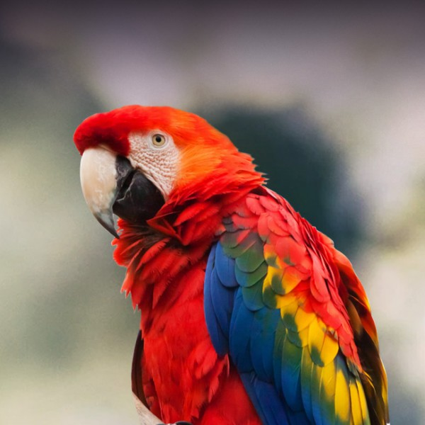
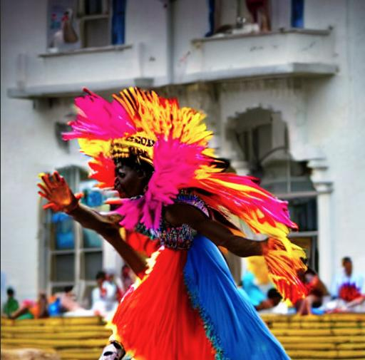
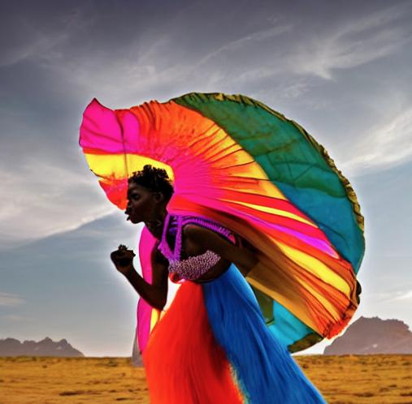
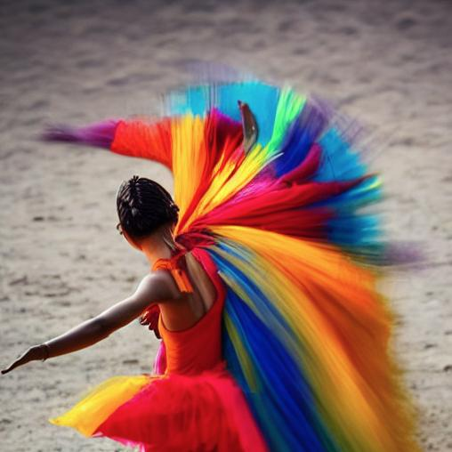
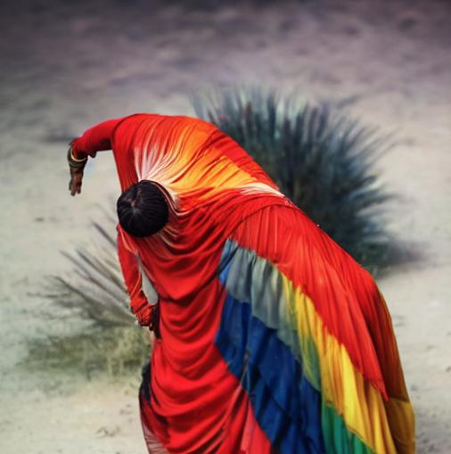
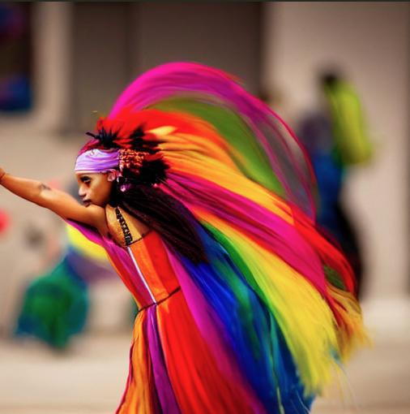

# How to get a good Macaw Dancer

Diffusion models are finicky to

1. num_inference_steps
    - the higher `num_inference_steps` is, the better the resolution
      - upon finding the right random seed, increase this to 1000, which will use every step in the reverse process
      - for example, when `num_inference_steps` = 50, there are 20 (1000/50 = 20) steps skipped in each iteration during the reverse process
        - if start_step t0 is 10, t1 will be 30, t2 will be 50
        - the larger the number of skipped steps
          - the faster the image will be produced
            - good for scanning random seed space
          - the lower the resolution of this image.
            - image will be not photo-realistic
              
    - possible problem at higher resolution
      - at low res, there will be out-of-focus objects in the background sucvh as people, houses
      - at high res, people/things in background disappears
        - background in images tend to become parimonious
         

2. start_step 
    - start_step will determine the starting variance 
      - start_step at 200 and that at 271 could produce vastly different images, albeit with the same random seed (see images below).
    - when increasing the resolution, it is important to keep this starting variance more or less equal.
      - if you explored the random seed space using `num_inference_steps = 100`, `start_step = 50`
         - when increasing resolution, use `num_inference_steps = 100 X 10`, `start_step = 50 X 10`
         - this will keep starting variance proportional
    - since diffusion model is quite finicky to this, when exploring the random seed space, best not to use `num_inference_steps` that are too small, as this will increase the number of skipped steps, in turn making the starting variance quite different even if you make the proportional adjustement to `start_step` as mentioned earlier.

3. random seed
    - different random seeds produce vastly different images
    - when selecting random seed, use 
      - num_inference_steps = 100 (50 in original deepdive nb)
      - start_step = 20 (10 in original deepdive nb)
        - this helps to keep starting variance the same when we increase the resolution.

  
---
## Input

prompt = "A colorful dancer, nat geo photo"

original image  

            

----
## Generated Images  

random seed = 32, from original notebook  
  
  

---  

random seed = 32,, start_step = 200    
  
  

----
random seed = 93, start_step = 200  
  
  

----
random seed = 93, start_step = 271   
  
  

----
random seed = 1, start_step = 200   
  
  

---

