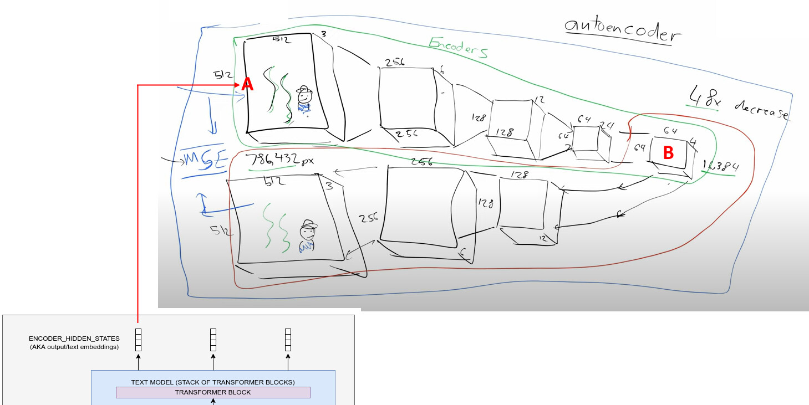

the text/output embeddings are fed in at point B, as point B is where the Unet resides.

Using "Stable Diffusion Deep Dive notebook, The Autoencoder" as an example,

At point A, we convert the image to latent using the vae encoder
```
def pil_to_latent(input_im):
    # Single image -> single latent in a batch (so size 1, 4, 64, 64)
    with torch.no_grad():
        latent = vae.encode(tfms.ToTensor()(input_im).unsqueeze(0).to(torch_device)*2-1) # Note scaling
    return 0.18215 * latent.latent_dist.sample()
```
This will output the latent. Next, we feed the latent into the Unet residing at B. Here the latent goes into a for-loop to denoise for certain number of time-steps. 
```
for i, t in tqdm(enumerate(scheduler.timesteps)):
```
and at each iteration, the latent is fed into the unet

```
noise_pred = unet(latent_model_input, t, encoder_hidden_states=text_embeddings)["sample"]
```
Inside the Unet, the text/output embeddings are fed repeatedly during the down-block, mid-block, and up-block (refer to huggingface diffuser UNet2DConditionModel codes [here](https://github.com/huggingface/diffusers/blob/4dce37432b8dc6ec88302b6c91b0700338c153e3/src/diffusers/models/unet_2d_condition.py#L266). I've annotated where the text embeddings are fed using three hashes ###


```
# 3. down
        down_block_res_samples = (sample,)
        for downsample_block in self.down_blocks:
            if hasattr(downsample_block, "attentions") and downsample_block.attentions is not None:
                sample, res_samples = downsample_block(
                    hidden_states=sample,
                    temb=emb,
                    encoder_hidden_states=encoder_hidden_states,  ### text-embedding fed into down-block
                )
            else:
                sample, res_samples = downsample_block(hidden_states=sample, temb=emb)

            down_block_res_samples += res_samples

        # 4. mid
        sample = self.mid_block(sample, emb, encoder_hidden_states=encoder_hidden_states) ### text-embedding fed into down-block

        # 5. up
        for i, upsample_block in enumerate(self.up_blocks):
            is_final_block = i == len(self.up_blocks) - 1

            res_samples = down_block_res_samples[-len(upsample_block.resnets) :]
            down_block_res_samples = down_block_res_samples[: -len(upsample_block.resnets)]

            # if we have not reached the final block and need to forward the
            # upsample size, we do it here
            if not is_final_block and forward_upsample_size:
                upsample_size = down_block_res_samples[-1].shape[2:]

            if hasattr(upsample_block, "attentions") and upsample_block.attentions is not None:
                sample = upsample_block(
                    hidden_states=sample,
                    temb=emb,
                    res_hidden_states_tuple=res_samples,
                    encoder_hidden_states=encoder_hidden_states, ### text-embedding fed into down-block
                    upsample_size=upsample_size,
                )
            else:
                sample = upsample_block(
                    hidden_states=sample, temb=emb, res_hidden_states_tuple=res_samples, upsample_size=upsample_size
```

The Unet will output a new latent, which we will feed back into the Unet until the for-loop ends. Everytime a new latent enters the Unet, the text-embedding is fed alongside again in the down-block, mid-block, and up-block.

Once the for-loop ends, we exit B, and feed the final latent to the decoder block (which is after point B). 
```
def latents_to_pil(latents):
    # bath of latents -> list of images
    latents = (1 / 0.18215) * latents
    with torch.no_grad():
        image = vae.decode(latents).sample
    image = (image / 2 + 0.5).clamp(0, 1)
    image = image.detach().cpu().permute(0, 2, 3, 1).numpy()
    images = (image * 255).round().astype("uint8")
    pil_images = [Image.fromarray(image) for image in images]
    return pil_images
```    

