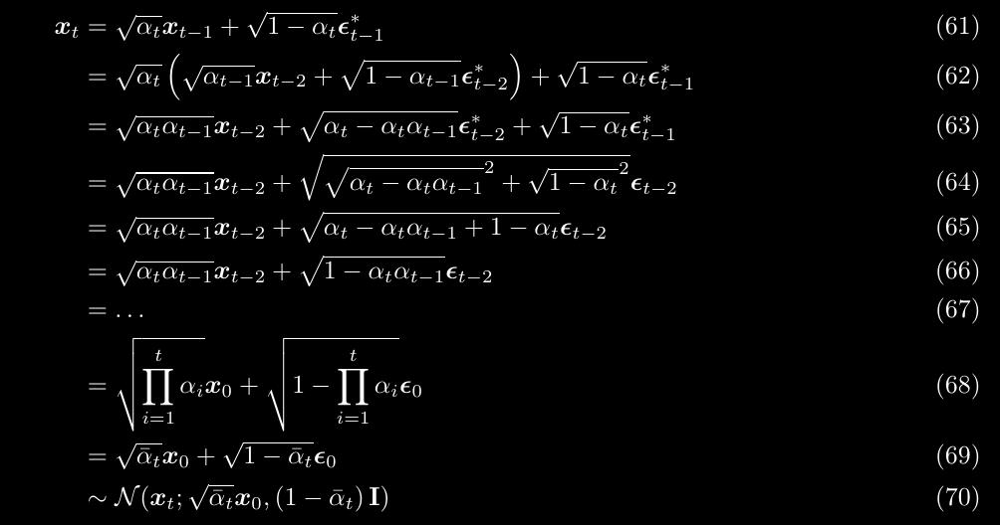
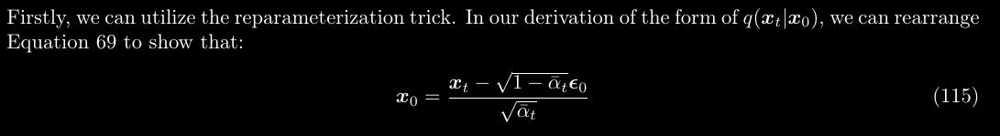
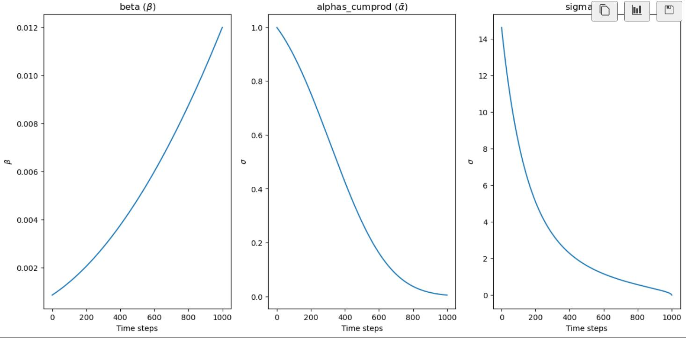

# Diffusion Model Variance Scheduler

The scheduler is trying to create different levels of variance for each of the 1000 time-steps.

  
For example, if you have an input $x_{t-1}$ , for example a latent, putting it through the Unet for one iteration in the for-loop (1000 steps) will produce an output $x_{t}$ that has a mean of $\sqrt{1-\beta_{t}} \times x_{t-1}$ and a variance of $\beta_{t}$ i.e standard deviation = $\sqrt{\beta_{t}}$,   something like   

$x_{t} = \sqrt{1-\beta_{t}} x_{t-1} + \sqrt{\beta_{t}}\epsilon$  
  
You could then do a [reparameterization trick](https://lilianweng.github.io/posts/2018-08-12-vae/#reparameterization-trick) to express $x_{t}$ in terms of $x_{0}$ (the original image from the dataset) instead of $x_{t-1}$ by creating a new variable called alpha using $\alpha = 1 - \beta$.  


After some maths , you will get 
  
$x_{t} = \sqrt{\bar{\alpha_{t}}} x_{{0}} + \sqrt{1- \bar{\alpha_{t}}}\epsilon$  

---
### Proof


The tedious maths to get `alpha_cumprod` is provided below      

  

  

[Source: Understanding Diffusion Models: A Unified Perspective](https://arxiv.org/abs/2208.11970)  


---  

  
Moving $x_{{0}}$ to the left-hand-side, we get

$x_{0} =  \frac{x_{{t}}}{\sqrt{\bar{\alpha_{t}}}}  - \sqrt{\frac{1- \bar{\alpha_{t}}}{\bar{\alpha_{t}}}}\epsilon$   


$\sqrt{\frac{1- \bar{\alpha_{t}}}{\bar{\alpha_{t}}}}$ is the sigmas $*\Sigma = \sqrt{\frac{1 - \alpha\_cumprod}{\alpha\_cumprod}}$


and is expresed in code as

```
sigmas = np.array(((1 - alphas_cumprod) / alphas_cumprod) ** 0.5)
```

Note that `alphas_cumprod` is a cumulative product  $$\bar{\alpha_{t}} = \prod_{i=0}^t \alpha_{i}$$ involving the multiplication of cumulative terms 

```
np.cumprod([1, 2, 3, 4])
> array([1, 2, 6, 24])
```


So now, if you run the following code, you can get `alphas_cumprod` or $\bar{\alpha}$
```
beta_start = 0.00085
beta_end = 0.012
betas =  torch.linspace(beta_start**0.5, beta_end**0.5, 1000, dtype=torch.float32) ** 2
alphas = 1.0 - betas
alphas_cumprod = torch.cumprod(alphas, dim=0)
```
and if you run the following code you get `sigmas` or $\sigma$ =  $\sqrt{\frac{1- \bar{\alpha_{t}}}{\bar{\alpha_{t}}}}$

```
sigmas = np.array(((1 - alphas_cumprod) / alphas_cumprod) ** 0.5)
sigmas = np.concatenate([sigmas[::-1], [0.0]]).astype(np.float32)
sigmas = torch.from_numpy(sigmas)
print("Sigma max:", sigmas.max())
> Sigma max: tensor(14.6146)
```


Plot $\beta$, $\sigma$  and $\bar{\alpha}$ using the following code
```
fig, axs = plt.subplots(1,3,figsize=(15, 7))

time_step = torch.linspace(0,1000,1000,dtype=torch.int)
axs[0].plot(time_step, betas)
axs[0].set(xlabel = "Time steps", ylabel ="$\\beta$")
axs[0].set_title("beta ($\\beta$)")

time_step = torch.linspace(0,1000,1000,dtype=torch.int)
axs[1].plot(time_step, alphas_cumprod)
axs[1].set(xlabel = "Time steps", ylabel ="$\\sigma$")
axs[1].set_title("alphas_cumprod ($\\bar{\\alpha}$)")

time_step = torch.linspace(0,1001,1001,dtype=torch.int)
time_step = torch.linspace(0,1001,1001,dtype=torch.int)
axs[2].plot(time_step, sigmas)
axs[2].set(xlabel = "Time steps", ylabel ="$\\sigma$")
axs[2].set_title("sigma ($\\sigma$)")
```



Note that for $\beta$, instead of a straight-line schedule using
```
beta = torch.linspace(beta_start, beta_end, noise_steps)
```
a slighly curved schedule is used for stability diffusion instead
```
beta =  torch.linspace(beta_start**0.5, beta_end**0.5, 1000) ** 2
```

---
END
